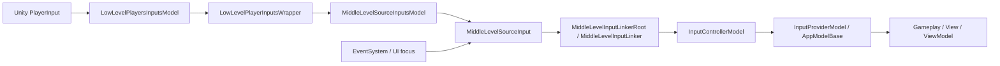

# Dingo Level Based Input System

[Русская версия](README_ru.md)

`DingoLevelBasedInputSystem` is a Unity input architecture layer that sits between `PlayerInput` and gameplay code.

Its goal is not just to read buttons, but to structure input into explicit layers: low-level device capture, middle-level source activation, controller-level model switching, and typed domain input models consumed by gameplay, view, and view model code.

This README is based on the actual implementation inside this repository and is intentionally written as technical documentation rather than a marketing overview.

## What Problem It Solves

In a typical Unity project, input tends to become hard to maintain very quickly:

- gameplay and UI start depending directly on `InputAction`;
- the same actions are subscribed to in multiple places;
- gameplay may still react while a menu, popup, or dialog is focused;
- moving from single-player to multiple input sources becomes expensive;
- testing is harder because the logic is coupled to `MonoBehaviour` callbacks and concrete action assets.

`DingoLevelBasedInputSystem` solves this by separating responsibilities:

1. the low-level layer owns raw `PlayerInput`;
2. the middle-level layer decides whether a source is allowed to drive gameplay at all;
3. the controller layer enables or disables typed input models;
4. gameplay works with domain models instead of raw `InputAction`.

## Architecture



### Data Flow

1. A `PlayerInput` instance is registered in `LowLevelPlayersInputsModel`.
2. It becomes a `LowLevelPlayerInputsWrapper` with an `Id` derived from `playerInput.user.id`.
3. `MiddleLevelSourceInputsModel` creates a `MiddleLevelSourceInput` through a linker function.
4. `MiddleLevelInputLinkerRoot` connects one or more linkers that map `InputAction` values into a typed model.
5. `InputControllerModel` controls which `AppModelBase` input models are currently enabled.
6. Gameplay and presentation code consume the typed provider model instead of directly talking to Unity Input System.

## Core Layers

### 1. Low-Level Layer

Files:

- `InputsHandle/Core/LowLevelPlayersInputsModel.cs`
- `InputsHandle/Core/LowLevelPlayerInputsWrapper.cs`

Responsibilities:

- register and remove `PlayerInput` sources;
- store them by string `Id`;
- enable or disable the underlying `PlayerInput`;
- notify higher layers when a player source appears or disappears.

Important details:

- `AddPlayer(PlayerInput)` creates a wrapper and raises `Added`;
- `RemovePlayer(...)` disposes the wrapper and raises `Removed`;
- `SetActive(id, bool)` directly changes `playerInput.enabled`;
- source ids are built with `playerInput.user.id.ToString()`.

This layer knows nothing about gameplay semantics or about concrete actions.

### 2. Middle-Level Layer

Files:

- `InputsHandle/Core/MiddleLevelSourceInput.cs`
- `InputsHandle/Core/MiddleLevelSourceInputsModel.cs`
- `Sample/Linkers/Core/MiddleLevelInputLinkerRoot.cs`
- `Sample/Linkers/Core/MiddleLevelInputLinker.cs`

Responsibilities:

- decide whether an input source is allowed to drive gameplay;
- bind a `PlayerInput` source to a mapping layer;
- centrally disable gameplay input while UI or other blocking states are active.

`MiddleLevelSourceInput`:

- stores the source `Id`;
- stores the related `LowLevelPlayerInputsWrapper`;
- exposes `Enabled`;
- raises `Enable` and `Disable` events.

`MiddleLevelSourceInputsModel`:

- is constructed with `Func<LowLevelPlayerInputsWrapper, MiddleLevelSourceInput>`;
- automatically creates a middle-level source when a low-level player is added;
- disables the source when the player is removed;
- can manually toggle a source by `Id`.

`MiddleLevelInputLinkerRoot` in the sample:

- creates the `MiddleLevelSourceInput`;
- calls `Link(...)` on all registered linkers;
- checks `EventSystem`;
- disables middle-level input when UI focus is active;
- respects safe UI areas through `RaycastSafetyArea`.

This is the layer that makes the system state-aware.

### 3. Controller Layer

Files:

- `InputControllerModels/InputControllerModel.cs`
- `InputControllerModels/InputControllerProperties.cs`
- `InputControllerModels/IReadonlyInputControllerModel.cs`
- `InputControllerModels/SingleInputControllersModel.cs`
- `InputControllerModels/MultipleInputControllersRegistererModel.cs`

This layer controls which typed input models are available to consumers.

#### `InputControllerModel`

Responsibilities:

- register `AppModelBase` models with `RegisterModel<T>()`;
- enable or disable a model with `EnableModel<T>()` and `DisableModel<T>()`;
- expose models through `TryGetModel<T>()` and `Model<T>()`;
- publish `ModelEnabled` and `ModelDisabled` events.

Key implementation detail:

- a model can be enabled or disabled even before its instance is registered;
- the controller remembers that state in `_enabled` or `_disabled`;
- once the model is registered later, the correct event is emitted.

That makes bootstrap ordering much more forgiving.

#### `SingleInputControllersModel`

Used when the app only needs one active controller model at a time.

It stores:

- one `InputControllerModel`;
- a bind wrapper that allows reactive subscription to its appearance.

#### `MultipleInputControllersRegistererModel`

Stores a dictionary of `sourceId -> InputControllerModel`.

Useful for:

- local co-op;
- split-screen;
- multiple independent devices;
- device pairing and player-selection flows.

It supports:

- controller registration and removal;
- mass enable or disable of a model type across all sources;
- a readonly controller dictionary for consumers.

### 4. Domain Input Model

Reference sample file:

- `Sample/SampleInputProviderModel.cs`

This is the application-facing model where raw `InputAction` values are converted into typed fields such as:

- `MovementInput`
- `MouseScreenPosition`
- `MouseDelta`
- `MouseScrollInput`
- `LeftMouseButton`
- `RightMouseButton`
- `Escape`
- `Focus`
- `LeftMouseDoubleClick`

Why this matters:

- gameplay reads a typed model instead of Unity callbacks;
- the model is easy to mock and test;
- derived semantics like double-click live in one place;
- changing the internal mapping does not force consumers to be rewritten.

## Linker Pattern

Files:

- `Sample/Linkers/Core/MiddleLevelInputLinker.cs`
- `Sample/Linkers/MiddleLevel/SamplePlayerMiddleLevelInputLinker.cs`

`MiddleLevelInputLinker` is the main extension point of the system.

It:

- receives `SingleInputControllersModel`;
- receives `MiddleLevelSourceInput`;
- finds the required `InputAction` instances in `PlayerInput.actions`;
- subscribes to them when the source is enabled;
- unsubscribes and resets the model when the source is disabled.

In the sample linker:

- `Escape`, `Focus`, `MouseViewPosition`, `MouseDelta`, `MovementInput`, `MouseScrollInput`, `LeftMouseButton`, and `RightMouseButton` are resolved;
- values are written into `SampleInputProviderModel`;
- double-click detection is handled in the linker;
- `SendDefaultValues()` is called on disable to avoid stale state.

## Consumer Helpers

Files:

- `Elements/InputModelDependBehaviour.cs`
- `Elements/InputModelDependViewModel.cs`
- `Elements/InputModelAppStateElementBehaviour.cs`

These helpers connect the input pipeline to runtime consumers.

`InputModelDependBehaviour<TInputModel>`:

- is a `MonoBehaviour` base class for components that depend on a typed input model;
- can optionally enable or disable the GameObject automatically.

`InputModelDependViewModel<T>`:

- is a view-model-side helper that subscribes to controller model activation;
- calls `EnableModel` or `DisableModel` when the typed model appears or disappears.

`InputModelAppStateElementBehaviour<T>`:

- integrates typed input activation with the app-state lifecycle;
- subscribes when the element becomes active and unsubscribes when it is torn down.

## Utility API

### `InputActionExtensions`

File: `Inputs/InputActionExtensions.cs`

Provides subscription helpers:

- `SSubscribe`
- `SPSubscribe`
- `SCSubscribe`
- `PCSubscribe`
- `FullSubscribe`
- `FullUnSubscribe`

This keeps linker code shorter and reduces symmetry mistakes in subscribe or unsubscribe code.

### `InputSystemExtensions`

File: `InputsHandle/Core/InputSystemExtensions.cs`

Provides helpers on top of `AppModelRoot`:

- `SetFullInputModelActive(appModelRoot, playerId, value)`  
  toggles both the low-level and middle-level source;
- `EnableHighLevelInputsOnly(appModelRoot, playerId)`  
  disables low-level and middle-level activity while leaving the higher architectural layers intact.

## Reference Sample Integration

The repository includes a self-contained sample integration in `Sample/`.

### Sample bootstrap

File:

- `Sample/SampleSinglePlayerInputHandler.cs`

What it does:

1. adds `PlayerInput` to `LowLevelPlayersInputsModel`;
2. optionally enables low-level and middle-level input on startup;
3. creates `InputControllerModel` for the source id;
4. places it into `SingleInputControllersModel`;
5. registers `SampleInputProviderModel`.

Core setup flow:

```csharp
_id = _appModelRoot.Get<LowLevelPlayersInputsModel>().AddPlayer(_playerInput);
if (_autoEnableOnInit)
    _appModelRoot.SetFullInputModelActive(_id, true);

var inputControllerModel = new InputControllerModel(new InputControllerProperties(_id));
var singleInputControllersModel = _appModelRoot.Get<SingleInputControllersModel>();
singleInputControllersModel.SetupInputControllerModel(inputControllerModel);
inputControllerModel.RegisterModel(new SampleInputProviderModel());
```

### Sample UI-aware source management

File:

- `Sample/Linkers/Core/MiddleLevelInputLinkerRoot.cs`

The sample root demonstrates how to:

- keep UI focus detection in one place;
- gate gameplay input through `MiddleLevelSourceInput.Enabled`;
- support multiple linkers over the same source.

## Dependencies

### Unity Package Dependency

- `com.unity.inputsystem`  
  Used for `PlayerInput`, `InputAction`, `InputActionPhase`, and action assets.

### Repository Dependencies

The following repository dependencies are visible from the current codebase and the superproject submodule configuration:

- `DingoProjectAppStructure`  
  Repository: `https://github.com/DingoBite/DingoProjectAppStructure.git`  
  Branch in `.gitmodules`: not specified  
  Notes: used directly by both the core and sample layers for `AppModelRoot`, `AppModelBase`, `AppViewModelBase`, `AppStateElementBehaviour`, and related app-state infrastructure.

- `UnityBindVariables`  
  Repository: `https://github.com/DingoBite/UnityBindVariables`  
  Branch in `.gitmodules`: not specified  
  Notes: provides the `Bind` types used by controller models, provider models, and view model helpers.

- `DingoUnityExtensions`  
  Repository: `https://github.com/DingoBite/DingoUnityExtensions`  
  Branch in `.gitmodules`: `dev`  
  Notes: used by the sample layer for helper extensions, singleton behavior, coroutine helpers, and safe UI area support.

When a branch is not specified in `.gitmodules`, the superproject still pins an exact submodule commit. In practice, the commit is authoritative and the branch is informational only when explicitly listed.

## How To Integrate Into a New Project

Minimum setup:

1. Add the repository under `Assets`.
2. Register `LowLevelPlayersInputsModel`.
3. Create `MiddleLevelInputLinkerRoot` in the scene and register it as an external dependency.
4. Register either `SingleInputControllersModel` or `MultipleInputControllersRegistererModel`.
5. Create `MiddleLevelSourceInputsModel` and pass a linker function into it.
6. Add a `PlayerInput` component to a scene object.
7. Create a handler similar to `SampleSinglePlayerInputHandler` that:
   - adds `PlayerInput` into the low-level model;
   - creates `InputControllerModel`;
   - registers your provider model;
   - optionally enables input on startup.
8. Create your own provider model.
9. Create your own linker that maps `InputAction` values into the provider model.

## How To Extend the System

### Add a New Input Model

1. Create a class derived from `AppModelBase`.
2. Add bind fields for the commands or axes you need.
3. Register it through `InputControllerModel.RegisterModel(...)`.
4. Toggle it with `EnableModel<T>()` and `DisableModel<T>()`.

### Add a New Linker

1. Derive from `MiddleLevelInputLinker`.
2. Resolve the needed `InputAction` instances from `PlayerInput.actions`.
3. Subscribe to them on `middleLevelSourceInput.Enable`.
4. Unsubscribe and reset the model on `Disable`.

### Add Multi-Player or Multi-Source Support

1. Use `MultipleInputControllersRegistererModel`.
2. Create a separate `InputControllerModel` per `sourceId`.
3. Keep a separate provider model per player.
4. Build gameplay or UI over the readonly controller dictionary.

## Advantages

### 1. Separation of Concerns

`PlayerInput`, UI focus logic, typed input state, and gameplay consumption are not mixed in one class.

### 2. State-Aware Input Gating

Input can be disabled at the source level without tearing down the higher-level architecture.

### 3. UI-Safe Behavior

The sample root shows how gameplay input can stop reacting while the UI owns focus.

### 4. Typed API Instead of Raw `InputAction`

Gameplay consumes meaningfully named fields rather than scattered Unity callbacks.

### 5. Bootstrap-Friendly Model Activation

`InputControllerModel` tolerates non-ideal initialization ordering.

### 6. Scales From Single-Player to Multi-Source

The repository contains both single-controller and dictionary-based controller models.

### 7. Easier Testing

Consumers can work with provider models as plain data-oriented input state.

### 8. One Mapping Point

The linker pattern centralizes input translation into a single class per source type.

### 9. Safe State Reset

`SendDefaultValues()` on disable helps prevent sticky buttons and stale axes.

## Limitations

- the module does not generate input action assets for you;
- it does not include a built-in rebinding UI;
- it does not persist user keymaps;
- domain semantics are defined by your provider model, not by the library itself;
- the sample UI-aware source management depends on scene and UI infrastructure;
- production projects usually need their own provider model and linker rather than using the sample directly.

## Folder Layout

- `Elements/`  
  Base behaviors and view-model helpers that depend on typed input models.
- `InputControllerModels/`  
  Controller models and registration helpers.
- `Inputs/`  
  Small extensions around `InputAction`.
- `InputsHandle/Core/`  
  Low-level and middle-level pipeline code.
- `Sample/`  
  Reference integration including provider model, linker root, linker, input actions, and prefabs.

## Summary

`DingoLevelBasedInputSystem` is not just a wrapper around Unity Input System. It is a runtime input pipeline that:

- normalizes input flow;
- introduces explicit activation layers;
- binds `PlayerInput` to typed application models;
- supports app-state and UI-aware gating;
- remains flexible enough for more complex projects.

In short, it turns input from a set of scattered callbacks into a controlled architecture.
