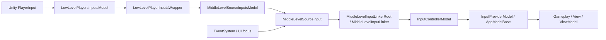

# Dingo Level Based Input System

[English version](README.md)

`DingoLevelBasedInputSystem` это архитектурный слой ввода для Unity, который ставит между `PlayerInput` и gameplay-кодом явный многоуровневый пайплайн.

Его задача не просто читать кнопки, а структурировать ввод по слоям: low-level захват устройства, middle-level активация источника, controller-level переключение моделей и typed input-модели, которые читает gameplay, view и view model.

Этот README основан на реальной реализации внутри репозитория и написан именно как техническая документация, а не как краткий рекламный обзор.

## Какую проблему решает модуль

В обычном Unity-проекте input-слой быстро становится неудобным:

- gameplay и UI начинают напрямую зависеть от `InputAction`;
- одно и то же действие подписывается в нескольких местах;
- gameplay продолжает реагировать на ввод, пока в фокусе меню, попап или диалог;
- переход от single-player к нескольким источникам ввода становится дорогим;
- тестирование усложняется, потому что логика привязана к `MonoBehaviour` и конкретным action asset.

`DingoLevelBasedInputSystem` решает это через разделение ответственности:

1. low-level слой владеет сырым `PlayerInput`;
2. middle-level слой решает, может ли источник вообще управлять gameplay;
3. controller-слой включает и выключает typed input-модели;
4. gameplay работает с доменными моделями, а не с сырыми `InputAction`.

## Архитектура



### Поток данных

1. Экземпляр `PlayerInput` регистрируется в `LowLevelPlayersInputsModel`.
2. Он превращается в `LowLevelPlayerInputsWrapper` с `Id`, построенным из `playerInput.user.id`.
3. `MiddleLevelSourceInputsModel` создает `MiddleLevelSourceInput` через linker-функцию.
4. `MiddleLevelInputLinkerRoot` подключает один или несколько linker-компонентов, которые маппят `InputAction` в typed-модель.
5. `InputControllerModel` управляет тем, какие `AppModelBase`-модели сейчас включены.
6. Gameplay и presentation-код читают provider model, а не Unity Input System напрямую.

## Основные слои

### 1. Low-level слой

Файлы:

- `InputsHandle/Core/LowLevelPlayersInputsModel.cs`
- `InputsHandle/Core/LowLevelPlayerInputsWrapper.cs`

Ответственность:

- регистрировать и удалять источники `PlayerInput`;
- хранить их по строковому `Id`;
- включать и выключать underlying `PlayerInput`;
- уведомлять верхние слои о появлении и исчезновении игрока.

Важные детали:

- `AddPlayer(PlayerInput)` создает wrapper и поднимает событие `Added`;
- `RemovePlayer(...)` вызывает `Dispose()` у wrapper и поднимает `Removed`;
- `SetActive(id, bool)` напрямую меняет `playerInput.enabled`;
- идентификатор источника строится через `playerInput.user.id.ToString()`.

Этот слой ничего не знает о gameplay-семантике и конкретных actions.

### 2. Middle-level слой

Файлы:

- `InputsHandle/Core/MiddleLevelSourceInput.cs`
- `InputsHandle/Core/MiddleLevelSourceInputsModel.cs`
- `Sample/Linkers/Core/MiddleLevelInputLinkerRoot.cs`
- `Sample/Linkers/Core/MiddleLevelInputLinker.cs`

Ответственность:

- решать, может ли источник сейчас управлять gameplay;
- связывать `PlayerInput`-источник с mapping-слоем;
- централизованно отключать gameplay-input, когда UI или другое состояние блокирует ввод.

`MiddleLevelSourceInput`:

- хранит `Id` источника;
- хранит связанный `LowLevelPlayerInputsWrapper`;
- имеет `Enabled`;
- публикует события `Enable` и `Disable`.

`MiddleLevelSourceInputsModel`:

- создается с `Func<LowLevelPlayerInputsWrapper, MiddleLevelSourceInput>`;
- автоматически создает middle-level источник при добавлении low-level игрока;
- выключает источник при удалении игрока;
- умеет вручную переключать источник по `Id`.

`MiddleLevelInputLinkerRoot` в sample:

- создает `MiddleLevelSourceInput`;
- вызывает `Link(...)` у всех зарегистрированных linker-компонентов;
- следит за `EventSystem`;
- выключает middle-level input, если UI держит фокус;
- учитывает безопасные UI-области через `RaycastSafetyArea`.

Именно этот слой делает систему state-aware.

### 3. Controller-слой

Файлы:

- `InputControllerModels/InputControllerModel.cs`
- `InputControllerModels/InputControllerProperties.cs`
- `InputControllerModels/IReadonlyInputControllerModel.cs`
- `InputControllerModels/SingleInputControllersModel.cs`
- `InputControllerModels/MultipleInputControllersRegistererModel.cs`

Этот слой управляет тем, какие typed input-модели доступны потребителям.

#### `InputControllerModel`

Ответственность:

- регистрировать `AppModelBase`-модели через `RegisterModel<T>()`;
- включать и выключать модель через `EnableModel<T>()` и `DisableModel<T>()`;
- отдавать модель через `TryGetModel<T>()` и `Model<T>()`;
- публиковать события `ModelEnabled` и `ModelDisabled`.

Ключевая деталь реализации:

- модель можно включить или выключить еще до фактической регистрации экземпляра;
- контроллер запоминает это состояние в `_enabled` или `_disabled`;
- когда экземпляр появится позже, будет отправлено корректное событие.

Это сильно упрощает bootstrap с неидеальным порядком инициализации.

#### `SingleInputControllersModel`

Используется там, где в приложении важен только один активный controller model.

Хранит:

- один `InputControllerModel`;
- bind-обертку для реактивной подписки на его появление.

#### `MultipleInputControllersRegistererModel`

Хранит словарь `sourceId -> InputControllerModel`.

Подходит для:

- local co-op;
- split-screen;
- нескольких независимых устройств;
- device pairing и выбора игрока.

Поддерживает:

- регистрацию и удаление контроллеров;
- массовое включение и выключение конкретного типа модели у всех источников;
- readonly-словарь контроллеров для потребителей.

### 4. Доменная input-модель

Референсный sample-файл:

- `Sample/SampleInputProviderModel.cs`

Это прикладной слой, где сырые `InputAction` преобразуются в typed-поля:

- `MovementInput`
- `MouseScreenPosition`
- `MouseDelta`
- `MouseScrollInput`
- `LeftMouseButton`
- `RightMouseButton`
- `Escape`
- `Focus`
- `LeftMouseDoubleClick`

Почему это важно:

- gameplay читает typed-модель вместо Unity callback-ов;
- модель легко мокать и тестировать;
- производная семантика, например double-click, живет в одном месте;
- изменение mapping-логики не требует переписывать всех потребителей.

## Linker-паттерн

Файлы:

- `Sample/Linkers/Core/MiddleLevelInputLinker.cs`
- `Sample/Linkers/MiddleLevel/SamplePlayerMiddleLevelInputLinker.cs`

`MiddleLevelInputLinker` это главная точка расширения системы.

Он:

- получает `SingleInputControllersModel`;
- получает `MiddleLevelSourceInput`;
- находит нужные `InputAction` в `PlayerInput.actions`;
- подписывается на них при активации источника;
- отписывается и сбрасывает модель при деактивации.

В sample-linker:

- резолвятся `Escape`, `Focus`, `MouseViewPosition`, `MouseDelta`, `MovementInput`, `MouseScrollInput`, `LeftMouseButton`, `RightMouseButton`;
- значения пишутся в `SampleInputProviderModel`;
- double-click вычисляется внутри linker;
- при `Disable` вызывается `SendDefaultValues()`, чтобы не оставлять stale state.

## Consumer helpers

Файлы:

- `Elements/InputModelDependBehaviour.cs`
- `Elements/InputModelDependViewModel.cs`
- `Elements/InputModelAppStateElementBehaviour.cs`

Эти helper-классы связывают input pipeline с runtime-потребителями.

`InputModelDependBehaviour<TInputModel>`:

- базовый `MonoBehaviour` для компонентов, которым нужен typed input-модель;
- умеет опционально автоматически активировать и деактивировать `GameObject`.

`InputModelDependViewModel<T>`:

- helper для view model слоя, который подписывается на активацию controller model;
- вызывает `EnableModel` или `DisableModel`, когда typed-модель появляется или исчезает.

`InputModelAppStateElementBehaviour<T>`:

- связывает активацию typed input с жизненным циклом app-state элемента;
- подписывается при активации элемента и отписывается при завершении.

## Utility API

### `InputActionExtensions`

Файл: `Inputs/InputActionExtensions.cs`

Содержит helper-методы подписки:

- `SSubscribe`
- `SPSubscribe`
- `SCSubscribe`
- `PCSubscribe`
- `FullSubscribe`
- `FullUnSubscribe`

Это делает linker-код компактнее и уменьшает количество ошибок в симметричной подписке и отписке.

### `InputSystemExtensions`

Файл: `InputsHandle/Core/InputSystemExtensions.cs`

Содержит helper-методы поверх `AppModelRoot`:

- `SetFullInputModelActive(appModelRoot, playerId, value)`  
  переключает и low-level, и middle-level источник;
- `EnableHighLevelInputsOnly(appModelRoot, playerId)`  
  отключает low-level и middle-level активность, оставляя верхние архитектурные слои нетронутыми.

## Reference sample integration

В репозитории есть самодостаточный sample в папке `Sample/`.

### Sample bootstrap

Файл:

- `Sample/SampleSinglePlayerInputHandler.cs`

Что он делает:

1. добавляет `PlayerInput` в `LowLevelPlayersInputsModel`;
2. при необходимости включает low-level и middle-level input на старте;
3. создает `InputControllerModel` для source id;
4. кладет его в `SingleInputControllersModel`;
5. регистрирует `SampleInputProviderModel`.

Базовый setup flow:

```csharp
_id = _appModelRoot.Get<LowLevelPlayersInputsModel>().AddPlayer(_playerInput);
if (_autoEnableOnInit)
    _appModelRoot.SetFullInputModelActive(_id, true);

var inputControllerModel = new InputControllerModel(new InputControllerProperties(_id));
var singleInputControllersModel = _appModelRoot.Get<SingleInputControllersModel>();
singleInputControllersModel.SetupInputControllerModel(inputControllerModel);
inputControllerModel.RegisterModel(new SampleInputProviderModel());
```

### Sample UI-aware source management

Файл:

- `Sample/Linkers/Core/MiddleLevelInputLinkerRoot.cs`

Sample root показывает, как:

- держать проверку UI focus в одном месте;
- gate-ить gameplay input через `MiddleLevelSourceInput.Enabled`;
- подключать несколько linker-компонентов к одному и тому же источнику.

## Зависимости

### Unity package dependency

- `com.unity.inputsystem`  
  Используется для `PlayerInput`, `InputAction`, `InputActionPhase` и action asset.

### Repository dependencies

Ниже перечислены репозиторные зависимости, которые видны из текущего кода и из конфигурации сабмодулей superproject:

- `DingoProjectAppStructure`  
  Repository: `https://github.com/DingoBite/DingoProjectAppStructure.git`  
  Branch in `.gitmodules`: не указана  
  Notes: напрямую используется и core-слоем, и sample-слоем для `AppModelRoot`, `AppModelBase`, `AppViewModelBase`, `AppStateElementBehaviour` и смежной app-state инфраструктуры.

- `UnityBindVariables`  
  Repository: `https://github.com/DingoBite/UnityBindVariables`  
  Branch in `.gitmodules`: не указана  
  Notes: поставляет `Bind`-типы, которые используются в controller model, provider model и view model helpers.

- `DingoUnityExtensions`  
  Repository: `https://github.com/DingoBite/DingoUnityExtensions`  
  Branch in `.gitmodules`: `dev`  
  Notes: используется sample-слоем для extension helper-ов, singleton behavior, coroutine helper-ов и safe UI area support.

Если ветка не указана в `.gitmodules`, superproject все равно пинит конкретный submodule commit. На практике именно commit является источником истины, а branch носит справочный характер только когда явно указан.

## Как подключить в новый проект

Минимальный setup:

1. Добавить репозиторий в `Assets`.
2. Зарегистрировать `LowLevelPlayersInputsModel`.
3. Создать `MiddleLevelInputLinkerRoot` в сцене и зарегистрировать его как внешнюю зависимость.
4. Зарегистрировать `SingleInputControllersModel` или `MultipleInputControllersRegistererModel`.
5. Создать `MiddleLevelSourceInputsModel` и передать в него linker-функцию.
6. Добавить `PlayerInput` на scene object.
7. Создать handler по аналогии с `SampleSinglePlayerInputHandler`, который:
   - добавит `PlayerInput` в low-level модель;
   - создаст `InputControllerModel`;
   - зарегистрирует provider model;
   - при необходимости включит input на старте.
8. Создать собственный provider model.
9. Создать собственный linker, который маппит `InputAction` в provider model.

## Как расширять систему

### Добавить новую input-модель

1. Создать класс-наследник `AppModelBase`.
2. Добавить bind-поля для нужных команд или осей.
3. Зарегистрировать модель через `InputControllerModel.RegisterModel(...)`.
4. Включать и выключать ее через `EnableModel<T>()` и `DisableModel<T>()`.

### Добавить новый linker

1. Унаследоваться от `MiddleLevelInputLinker`.
2. Разрешить нужные `InputAction` через `PlayerInput.actions`.
3. Подписывать их при `middleLevelSourceInput.Enable`.
4. Отписывать и сбрасывать модель при `Disable`.

### Добавить multi-player или multi-source поддержку

1. Использовать `MultipleInputControllersRegistererModel`.
2. Создавать отдельный `InputControllerModel` на каждый `sourceId`.
3. Хранить отдельный provider model на каждого игрока.
4. Поднимать gameplay или UI поверх readonly-словаря контроллеров.

## Преимущества

### 1. Разделение ответственности

`PlayerInput`, UI focus logic, typed input state и gameplay consumption не смешиваются в одном классе.

### 2. State-aware input gating

Ввод можно отключать на уровне источника, не разрушая верхнюю архитектуру.

### 3. UI-safe поведение

Sample root показывает, как gameplay input можно останавливать, пока UI держит фокус.

### 4. Typed API вместо сырых `InputAction`

Gameplay работает с осмысленными полями, а не с разбросанными callback-ами Unity.

### 5. Устойчивый bootstrap

`InputControllerModel` хорошо переносит неидеальный порядок инициализации.

### 6. Масштабирование от single-player к multi-source

В репозитории уже есть и single-controller, и dictionary-based controller модели.

### 7. Более простое тестирование

Потребители могут работать с provider model как с обычным data-oriented input state.

### 8. Единая точка mapping-а

Linker-паттерн централизует преобразование ввода в одном классе на тип источника.

### 9. Безопасный сброс состояния

`SendDefaultValues()` при выключении помогает избегать залипших кнопок и старых значений осей.

## Ограничения

- модуль не генерирует action asset за вас;
- в нем нет встроенного rebinding UI;
- он не сохраняет пользовательские keymap-профили;
- доменная семантика задается вашим provider model, а не библиотекой;
- sample-реализация UI-aware gating зависит от scene и UI инфраструктуры;
- в production-проектах обычно нужен собственный provider model и свой linker, а sample стоит использовать как reference.

## Структура папок

- `Elements/`  
  Базовые behavior и view model helpers, зависящие от typed input model.
- `InputControllerModels/`  
  Controller model и helper-ы регистрации.
- `Inputs/`  
  Небольшие расширения над `InputAction`.
- `InputsHandle/Core/`  
  Low-level и middle-level pipeline код.
- `Sample/`  
  Reference integration: provider model, linker root, linker, input actions и prefabs.

## Резюме

`DingoLevelBasedInputSystem` это не просто обертка над Unity Input System. Это runtime input pipeline, который:

- нормализует поток ввода;
- вводит явные слои активации;
- связывает `PlayerInput` с typed application model;
- поддерживает app-state и UI-aware gating;
- остается достаточно гибким для более сложных проектов.

Если кратко: модуль превращает ввод из набора разрозненных callback-ов в управляемую архитектуру.
